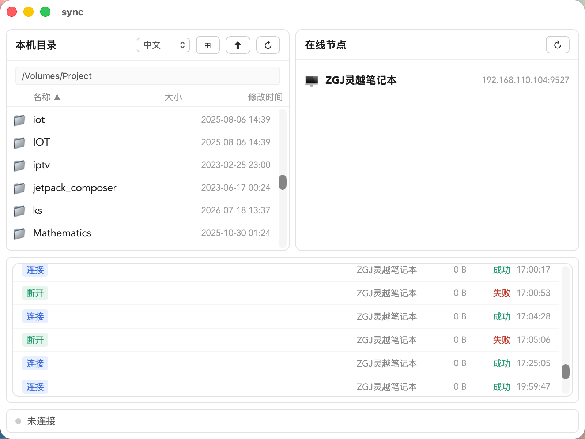
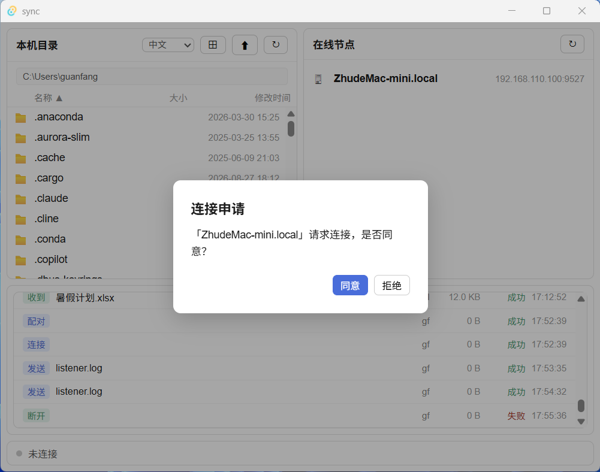
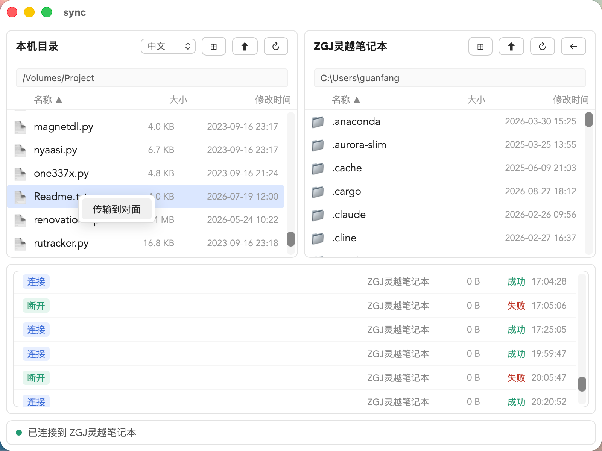

# 局域网文件目录同步工具（sync）


> 本仓库为**发布仓库（Release-only）**：只提供编译好的安装包与使用文档，**不包含源代码**。
> 本项目为**闭源专有软件**，使用条款见 [LICENSE](LICENSE)；其中包含的第三方开源组件见 [THIRD_PARTY_NOTICES.md](THIRD_PARTY_NOTICES.md)。

跨平台（Windows / macOS / Linux）的局域网文件与目录传输工具。无中心服务器，各设备运行本程序即可自动发现彼此，点对点加密传输。

## 功能特性

- 🔍 **零配置节点发现**：mDNS 自动发现局域网内的其他节点，无需服务器、无需手动配 IP。
- 🔒 **加密传输**：连接时自动密钥协商，AES-256-GCM 认证加密传输。
- 📁 **双向目录浏览**：连接后浏览对方目录，支持 Windows 盘符、macOS/Linux 根目录。
- 📤 **单文件 / 多文件 / 目录传输**：右键传输、多选、目录递归重建。
- ⏯ **断点续传 + SHA-256 校验**：中断续传、完整性校验、失败自动重试。
- ⚠️ **冲突处理**：同名文件弹窗选择覆盖 / 重命名 / 取消，可「应用到所有」。
- 📋 **审计日志**：记录连接 / 断开 / 配对 / 拒绝 / 传输，持久化到本地；主窗口底部日志区实时显示。
- 📑 **双栏布局**：主窗口第一行左右两栏（本机目录 | 对方目录），第二行日志区域占满全宽。
- 🚀 **系统托盘 + 开机自启**：关闭窗口后后台常驻；收到连接申请时自动显示主窗口弹窗确认。

## 截图





## 下载

从 [Releases](releases/) 下载，或直接使用本仓库 `installers/` 目录中的文件：

| 平台 | 架构 | 安装包 | 大小 | 状态 |
|------|------|--------|------|------|
| macOS | Apple Silicon (arm64) | [sync_0.1.0_aarch64.dmg](installers/sync_0.1.0_aarch64.dmg) | 4.0 MB | ✅ 已提供 |
| Linux | amd64 (deb) | [sync_0.1.0_amd64.deb](installers/sync_0.1.0_amd64.deb) | 5.0 MB | ✅ 已提供 |
| Linux | x86_64 (rpm) | [sync-0.1.0_x86_64.rpm](installers/sync-0.1.0_x86_64.rpm) | 5.0 MB | ✅ 已提供 |
| Linux | x86_64 (AppImage) | [sync_0.1.0_amd64.AppImage](installers/sync_0.1.0_amd64.AppImage) | 87 MB | ✅ 已提供 |
| Windows | x64 (msi) | [sync_0.1.0_x64_en-US.msi](installers/sync_0.1.0_x64_en-US.msi) | 3.9 MB | ✅ 已提供 |
| Windows | x64 (exe) | [sync_0.1.0_x64-setup.exe](installers/sync_0.1.0_x64-setup.exe) | 2.7 MB | ✅ 已提供 |

每个安装包的 SHA-256 校验和见 [checksums.txt](checksums.txt)。

## 校验安装包完整性

下载后建议先校验 SHA-256，再安装：

```bash
# macOS / Linux
shasum -a 256 -c checksums.txt

# Windows (PowerShell)
Get-FileHash .\installers\sync_0.1.0_x64_en-US.msi -Algorithm SHA256
```

## 安装说明

### macOS

1. 打开 `.dmg`，将 `sync` 拖入「应用程序」。
2. 安装包未签名，首次打开如提示「无法验证开发者」，请在「系统设置 → 隐私与安全性」中点击「仍要打开」，或右键应用图标 →「打开」。

### Linux

按你的发行版选择安装包：

**Debian / Ubuntu（.deb）**

```bash
sudo apt install ./sync_0.1.0_amd64.deb
```

`apt` 会自动拉取运行时依赖（GTK3 / WebKit2GTK / libsoup3 等）。安装后桌面应用菜单中会出现 `sync`。

**Fedora / RHEL / openSUSE（.rpm）**

```bash
sudo dnf install ./sync-0.1.0_x86_64.rpm   # Fedora / RHEL
sudo zypper install ./sync-0.1.0_x86_64.rpm # openSUSE
```

**任意发行版（AppImage，免安装）**

```bash
chmod +x sync_0.1.0_amd64.AppImage
./sync_0.1.0_amd64.AppImage
```

AppImage 不需要安装，直接运行即可（若提示需要 FUSE，安装 `libfuse2` 后重试）。

### Windows

1. 运行 `.msi`（或 `.exe` 安装向导），按提示完成安装。
2. 安装包未签名，SmartScreen 可能提示「已阻止运行」→ 点击「更多信息」→「仍要运行」。

## 首次使用

1. 在**两台及以上**设备上运行本程序，它们会自动互相发现（出现在「在线节点」列表）。
2. 双击（或右键）对方节点发起连接。
3. 对方收到连接申请后点击「同意」，双方自动完成加密协商并建立连接。
4. 连接成功后，右侧显示对方目录；在左侧本机目录右键文件/目录 →「传输到对面」。传输日志实时显示在主窗口底部的日志区域。

## 日志与数据位置

- 审计日志：持久化于系统配置目录下的 `lansync/audit.log`：
  - Windows：`%APPDATA%\lansync\audit.log`
  - macOS：`~/Library/Application Support/lansync/audit.log`
  - Linux：`~/.config/lansync/audit.log`

## 常见问题

- **两台设备互相发现不了？** 确认处于同一局域网 / 同一网段，且防火墙未拦截 mDNS（UDP 5353）与程序端口。
- **连接失败？** 检查两端是否都运行了本程序，且未被防火墙拦截；日志区会显示失败原因。
- **传输中断？** 程序支持断点续传，重新连接后会自动续传未完成的部分。

## 许可证

本项目为**闭源专有软件**，详细条款见 [LICENSE](LICENSE)。

- 最终用户可免费安装使用，但不得分发、修改或逆向工程；
- 软件中包含的第三方开源组件遵循其各自许可协议（MIT / Apache-2.0 / BSD / MPL-2.0 等），见 [THIRD_PARTY_NOTICES.md](THIRD_PARTY_NOTICES.md)。

## 更新日志

- **v0.1.0**（2026-08-26）：首个公开版本。节点发现、加密连接、双向目录浏览、文件/目录传输、断点续传、审计日志、系统托盘。
